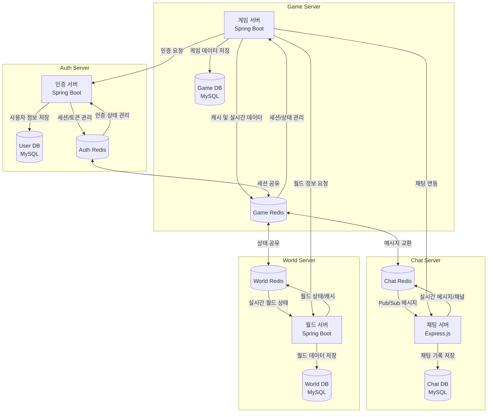
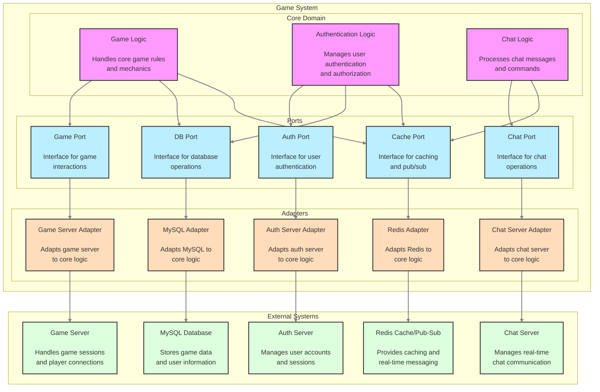

```mermaid
graph TD
  subgraph Game Server
    GS[게임 서버<br/>Spring Boot] -->|게임 데이터 저장| GDB[(Game DB<br/>MySQL)]
    GS -->|캐시 및 실시간 데이터| GR[(Game Redis)]
    GR -->|세션/상태 관리| GS
  end

  subgraph Auth Server
    AS[인증 서버<br/>Spring Boot] -->|사용자 정보 저장| UDB[(User DB<br/>MySQL)]
    AS -->|세션/토큰 관리| AR[(Auth Redis)]
    AR -->|인증 상태 관리| AS
  end

  subgraph Chat Server
    CS[채팅 서버<br/>Express.js] -->|채팅 기록 저장| CDB[(Chat DB<br/>MySQL)]
    CS -->|실시간 메시지/채널| CR[(Chat Redis)]
    CR -->|Pub/Sub 메시지| CS
  end

  subgraph World Server
    WS[월드 서버<br/>Spring Boot] -->|월드 데이터 저장| WDB[(World DB<br/>MySQL)]
    WS -->|월드 상태/캐시| WR[(World Redis)]
    WR -->|실시간 월드 상태| WS
  end
  GS -->|인증 요청| AS
  GS -->|채팅 연동| CS
  GS -->|월드 정보 요청| WS
  GR <-->|메시지 교환| CR
  GR <-->|상태 공유| WR
  AR <-->|세션 공유| GR
```

```mermaid
graph TB
    subgraph "Game System"
        subgraph "Core Domain"
            B["Game Logic<br><br>Handles core game rules<br>and mechanics"]
            F["Authentication Logic<br><br>Manages user authentication<br>and authorization"]
            H["Chat Logic<br><br>Processes chat messages<br>and commands"]
        end

        subgraph "Ports"
            P1["Game Port<br><br>Interface for game<br>interactions"]
            P2["Auth Port<br><br>Interface for user<br>authentication"]
            P3["Chat Port<br><br>Interface for chat<br>operations"]
            P4["DB Port<br><br>Interface for database<br>operations"]
            P5["Cache Port<br><br>Interface for caching<br>and pub/sub"]
        end
    
        subgraph "Adapters"
            A1["Game Server Adapter<br><br>Adapts game server<br>to core logic"]
            A2["Auth Server Adapter<br><br>Adapts auth server<br>to core logic"]
            A3["Chat Server Adapter<br><br>Adapts chat server<br>to core logic"]
            A4["MySQL Adapter<br><br>Adapts MySQL to<br>core logic"]
            A5["Redis Adapter<br><br>Adapts Redis to<br>core logic"]
        end
    end
    
    subgraph "External Systems"
        E1["Game Server<br><br>Handles game sessions<br>and player connections"]
        E2["Auth Server<br><br>Manages user accounts<br>and sessions"]
        E3["Chat Server<br><br>Manages real-time<br>chat communication"]
        E4["MySQL Database<br><br>Stores game data<br>and user information"]
        E5["Redis Cache/Pub-Sub<br><br>Provides caching and<br>real-time messaging"]
    end
    
    B --> P1 & P4 & P5
    F --> P2 & P4 & P5
    H --> P3 & P5
    
    P1 --> A1
    P2 --> A2
    P3 --> A3
    P4 --> A4
    P5 --> A5
    
    A1 --> E1
    A2 --> E2
    A3 --> E3
    A4 --> E4
    A5 --> E5
    
    classDef core fill:#f9f,stroke:#333,stroke-width:2px;
    classDef port fill:#bef,stroke:#333,stroke-width:2px;
    classDef adapter fill:#fdb,stroke:#333,stroke-width:2px;
    classDef external fill:#dfd,stroke:#333,stroke-width:2px;
    
    class B,F,H core;
    class P1,P2,P3,P4,P5 port;
    class A1,A2,A3,A4,A5 adapter;
    class E1,E2,E3,E4,E5 external;
    
    linkStyle default stroke-width:2px,fill:none,stroke:gray;
```
