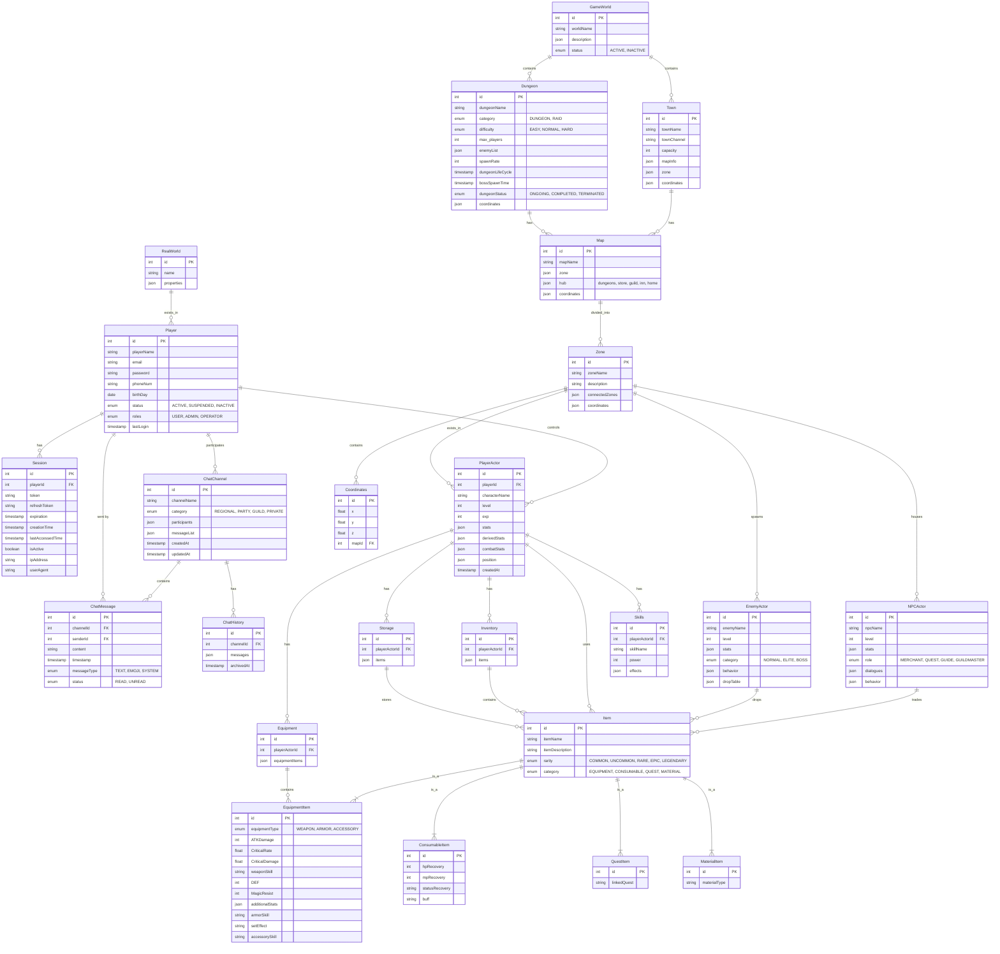

### 1. Real World Connection

- RealWorld
  - 현실 세계를 나타내며, 시스템의 최상위 환경.
- Player
  - 현실 세계에 존재하는 사용자 계정.
  - 각 플레이어는 RealWorld에 속하며, 여러 세션(Session)을 가지며, 게임 내 캐릭터(PlayerActor)를 조종하고, 채팅(ChatChannel)에 참여.

------

### 2. Auth Domain (인증 도메인)

- Player
  - 사용자 계정 정보(이름, 이메일, 비밀번호, 전화번호, 생년월일, 상태, 역할, 최근 접속 시간 등)를 관리.
- Session
  - 플레이어의 로그인 세션 정보를 저장.
  - 토큰, 리프레시 토큰, 만료 시간, 접속 IP, 접속 환경 등의 정보가 포함.

------

### 3. Chat Domain (채팅 도메인)

- ChatChannel
  - 플레이어들이 참여하는 채팅 채널.
  - 채널에는 채널 이름, 카테고리(지역, 파티, 길드, 개인), 참가자 목록, 메시지 리스트 등이 포함.
- ChatMessage
  - 채팅 채널 내에서 전송되는 개별 메시지를 관리.
  - 메시지 내용, 전송 시간, 메시지 유형(텍스트, 이모티콘, 시스템 메시지) 및 상태(읽음/읽지 않음)가 기록.
- ChatHistory
  - 채팅 채널의 메시지 기록을 보관하는 역할.

------

### 4. Game Domain (게임 도메인)

- PlayerActor
  - 플레이어가 게임 내에서 조종하는 캐릭터.
  - 캐릭터 이름, 레벨, 경험치, 기본 능력치, 파생 스탯, 전투 스탯, 위치(포지션) 등이 포함.
- Inventory, Equipment, Storage, Skills
  - 각각 플레이어 캐릭터의 인벤토리, 장비, 보관함, 스킬 정보를 관리.
- Item
  - 게임 내에서 사용되는 모든 아이템의 기본 엔티티.
  - 아이템 이름, 설명, 희귀도, 분류 등의 정보를 가짐.
  - **EquipmentItem, ConsumableItem, QuestItem, MaterialItem**과 같은 여러 하위 타입으로 구분되어 있음.
- NPCActor
  - 마을 등에서 등장하는 NPC로, 상점, 퀘스트 제공, 가이드 등 다양한 역할을 함.
  - NPC는 아이템을 거래(판매)할 수 있음.
- EnemyActor
  - 던전 등에서 등장하는 적 캐릭터.
  - 적은 전투 후 아이템을 드랍.

------

### 5. World Domain (월드 도메인)

- GameWorld
  - 전체 게임 월드를 나타내며, 여기에는 마을과 던전이 포함.
- Town (마을)
  - 게임월드 내의 마을로, 플레이어들이 모여 NPC와 상호작용하는 공간.
  - 마을에는 채널(채팅), 맵 정보, 구역(zone), 좌표 등이 포함.
- Dungeon (던전)
  - 인스턴스 형식의 던전 공간.
  - 던전은 난이도, 최대 입장 인원, 몬스터 목록, 스폰 속도, 보스 등장 시간, 던전 생명주기(예: 일정 시간이 지나면 자동 삭제) 등의 정보를 가짐.
- Map (맵)
  - 마을과 던전 각각에 속하는 맵으로, 플레이어가 이동하는 실제 영역.
- Zone (구역)
  - 각 맵은 여러 구역으로 나뉘며, Zone은 맵 내의 세부 영역(예: 상업구역, 마법구역 등)을 나타냄.
  - Zone은 연결된 구역 정보와 구역 내 좌표 범위 등을 포함.
- Coordinates (좌표 시스템)
  - 맵 내의 정확한 위치 정보를 관리.
  - 각 좌표는 x, y, z 값과 함께, 해당 맵에 속하는 정보로 NPC, 적, 플레이어의 위치를 결정.

------

### 6. Actor와 Item의 상호작용

- **NPCActor**는 아이템을 거래(판매, 매입).
- **EnemyActor**는 전투 후 아이템을 드랍.
- **PlayerActor**는 획득한 아이템을 사용하며, 인벤토리, 장비, 보관함을 통해 관리.
- 플레이어는 또한 스킬을 보유하고 장착.

------

### 7. 전체 관계 요약

- **RealWorld**는 여러 **Player**를 포함.
- **Player**는 여러 **Session**을 가지며, **PlayerActor**를 통해 게임에 참여하고, **ChatChannel**에 참여.
- **ChatChannel**은 여러 **ChatMessage**와 **ChatHistory**를 포함.
- **GameWorld**는 여러 **Town**(마을)과 **Dungeon**(던전)을 포함.
- **Town**과 **Dungeon**은 각각 하나 이상의 **Map**을 가지며, 맵은 여러 **Zone**으로 나뉨.
- **Zone**은 **Coordinates**를 통해 구체적인 위치 정보를 제공하며, 이곳에 **NPCActor**, **EnemyActor**, **PlayerActor**가 위치함.
- **Item** 시스템은 NPC, 적, 플레이어 액터 간에 아이템 거래, 드랍, 사용 등의 상호작용을 관리.
- **PlayerActor**는 인벤토리, 장비, 보관함, 스킬을 통해 게임 내 자원을 관리.
