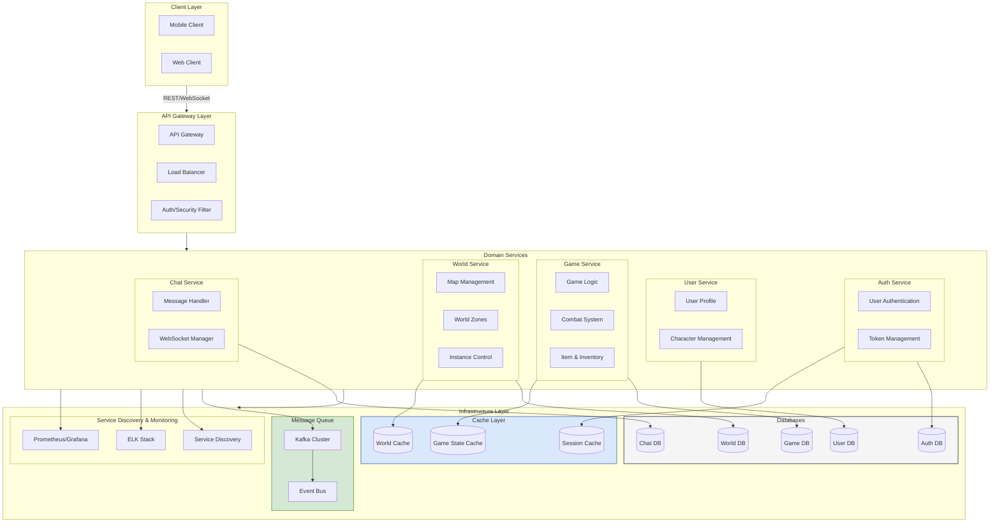

## **전체 서버 아키텍처 구성**

### **1. 클라이언트 (Client Layer)**

- **웹 클라이언트 (React, WebGL, Three.js)**
- API 요청: **REST API / WebSocket** 사용
- 클라이언트는 백엔드와 통신하며, 사용자 입력을 받아 서버에 요청을 보냄

------

### **2. API Gateway & Load Balancing (Gateway Layer)**

- **API Gateway (Spring Cloud Gateway / Nginx / Kong)**
- **로드 밸런서 (Load Balancer - AWS ALB, Nginx, HAProxy)**
- 요청이 들어오면 해당 도메인 서버로 라우팅
- 인증 및 보안 필터 적용 (JWT, OAuth)

------

### **3. 도메인 서비스 (Domain Services)**

각각의 기능을 담당하는 **마이크로서비스 기반 도메인 서버**를 운영

#### **인증 서비스 (Auth Service)**

- 사용자 로그인 및 인증
- JWT / OAuth 2.0 토큰 관리
- `MySQL/PostgreSQL` 활용하여 유저 정보 저장

#### **사용자 서비스 (User Service)**

- 유저 프로필 관리
- 캐릭터 생성, 수정, 조회
- `Redis`를 활용한 세션 캐싱

#### **게임 서비스 (Game Service)**

- 게임 내 핵심 로직 (전투, 아이템, 인벤토리)
- `Redis`를 활용한 게임 상태 캐싱

#### **월드 서비스 (World Service)**

- 맵, 월드 영역 관리
- 플레이어 이동, 위치 좌표 시스템
- 인스턴스 기반 던전 생성 및 관리

#### **채팅 서비스 (Chat Service)**

- WebSocket 기반 실시간 채팅
- 채팅 메시지 로그 저장 (NoSQL - MongoDB)

------

### **4. 데이터 저장소 (Databases)**

- **MySQL/PostgreSQL** → 영구 저장 (유저 정보, 캐릭터, 게임 데이터)
- **Redis** → 캐시 및 세션 관리 (로그인 세션, 게임 상태)
- **MongoDB / Cassandra** → 비정형 데이터 저장 (채팅 로그, 이벤트 로그)

------

### **5. 메시지 큐 (Message Queue)**

- **Kafka / RabbitMQ** → 도메인 간 이벤트 메시지 처리
- 비동기 이벤트 (ex: 유저가 아이템 구매 시, 인벤토리 & 결제 서비스에서 비동기 처리)

------

### **6. 인프라 관리 (Infrastructure Layer)**

- **Docker / Kubernetes (K8s)** → 컨테이너 기반 배포
- **서비스 디스커버리 (Eureka / Consul)** → 마이크로서비스 찾기
- **로그 & 모니터링 (ELK Stack, Prometheus, Grafana)** → 로그 분석 및 서버 상태 모니터링

------

## ** 전체 동작 흐름 (워크플로우)**

1. **클라이언트 (React, Mobile App)** → API Gateway에 요청
2. **API Gateway** → 요청을 해당 도메인 서버로 전달
3. **도메인 서버 (Auth, Game, World 등)** → 데이터베이스 조회 or 캐시 활용
4. **Redis 캐시** 활용하여 빠른 응답
5. **Kafka 메시지 큐** → 비동기 이벤트 처리
6. **API Gateway → 클라이언트로 응답 전송**

------

## **핵심 정리**

- **모든 서비스는 도메인별로 분리된 마이크로서비스 구조**
- **Redis, Kafka를 활용한 성능 최적화**
- **API Gateway를 통해 클라이언트와 서버 간 통신**
- **Docker + Kubernetes 기반 배포**
