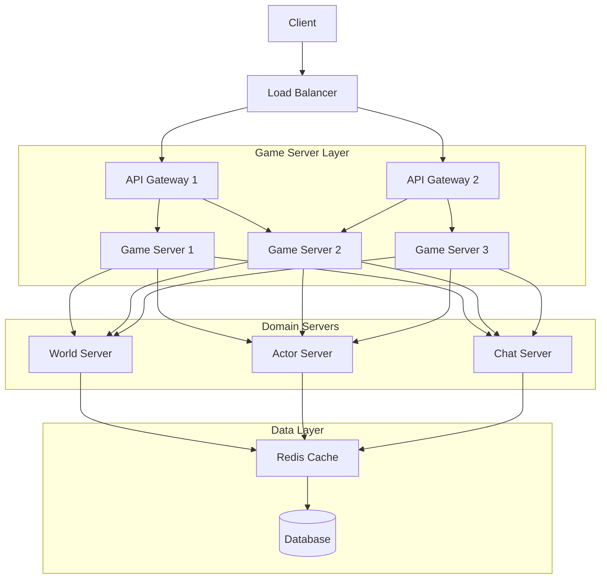

# **1. 전체적인 서버 구조 및 확장 방식**

## **서버 계층 구조**

```css
[Client]  
   ↓  
[로드 밸런서]  <-- 수평 확장 가능  
   ↓  
[API Gateway 1]  [API Gateway 2]  <-- 수평 확장 가능  
   ↓  
[게임 서버 1]   [게임 서버 2]   [게임 서버 3] <-- 수평 확장 가능  
   ↓  
[월드 서버]  [액터 서버]  [채팅 서버]  
   ↓  
[Redis 캐싱] + [DB Master-Slave]

```


## **기본 개념: 트래픽에 따른 동적 확장 (Auto Scaling)**

- 초기에는 **기본 전체 서버(1, 2)** 만 배치
- 트래픽 증가 시 **전체 서버 3, 4, … 추가**
- 트래픽 감소 시 **불필요한 전체 서버 제거**
- 하나의 클라우드 내에서 확장 후, 필요 시 **추가 클라우드로 확장**

## **서버 확장 방식**

- 1️. 클라우드 내에서 **전체 서버 단위로 확장**
- 2️. 필요 시 **클라우드 자체를 추가로 빌려 확장**

```scss
클라우드 1
├── 전체 서버 1  (게임서버 1, 2, 3 포함)
├── 전체 서버 2  (게임서버 1, 2, 3 포함)

트래픽 증가 시
클라우드 1
├── 전체 서버 1  (게임서버 1, 2, 3 포함)
├── 전체 서버 2  (게임서버 1, 2, 3 포함)
├── 전체 서버 3  (게임서버 1, 2, 3 포함)  ← 추가

더 큰 확장이 필요할 경우
클라우드 2 추가 (독립적인 전체 서버 세트 운영)
```

------

# **2. 구체적인 기술 스택**

## **네트워크 및 트래픽 관리**

| 기능        | 기술 스택                                    |
| ----------- | -------------------------------------------- |
| 로드 밸런싱 | **Nginx, Envoy Proxy, AWS ALB(로드 밸런서)** |
| API Gateway | **Kong Gateway, AWS API Gateway, Traefik**   |
| 서비스 메시 | **Istio, Linkerd (Kubernetes 기반 확장 시)** |

## **게임 서버 및 도메인 설계**

| 기능               | 기술 스택                                                 |
| ------------------ | --------------------------------------------------------- |
| 게임 서버 관리     | **Node.js (NestJS), Golang, C++ (Unreal Engine/Unity)**   |
| 멀티플레이 엔진    | **Photon, Mirror, Nakama, AWS Gamelift**                  |
| 실시간 데이터 처리 | **gRPC, WebSocket, ZeroMQ, Kafka (이벤트 기반 아키텍처)** |

## **데이터 관리 및 캐싱**

| 기능          | 기술 스택                                          |
| ------------- | -------------------------------------------------- |
| 캐싱          | **Redis, Memcached**                               |
| DB            | **PostgreSQL, MySQL, MongoDB (Master-Slave 구성)** |
| 데이터 동기화 | **Kafka, NATS, RabbitMQ**                          |

## **서버 확장 및 배포**

| 기능          | 기술 스택                                                    |
| ------------- | ------------------------------------------------------------ |
| 컨테이너 관리 | **Docker, Kubernetes(K8s)**                                  |
| 오토스케일링  | **K8s HPA(Horizontal Pod Autoscaler), AWS Auto Scaling Group (ASG)** |
| 인프라 자동화 | **Terraform, Ansible**                                       |

------

# **3. 세부적인 서버 구조 설정**

## **서버 역할별 구성**

### **1. 게임 서버**

- 클라이언트와 직접 통신
- 월드 서버, 액터 서버, 채팅 서버와 내부 통신
- WebSocket 및 gRPC 기반의 실시간 데이터 처리

### **2. API Gateway**

- 클라이언트 요청을 적절한 게임 서버로 분배
- 인증 및 권한 관리
- REST, GraphQL, WebSocket 지원

### **3. 월드 서버**

- 게임 내 지역(마을, 던전 등) 관리
- 유저가 어디에 위치하는지 추적

### **4. 액터 서버**

- 유저 캐릭터, NPC, 적 관리
- AI 행동 로직 및 상태 저장

### **5. 채팅 서버**

- 유저 간 실시간 채팅
- 채팅 로그 저장 및 관리

### **6. 데이터 관리**

- Redis: 게임 상태 및 캐싱
- DB (Master-Slave): 게임 데이터 영구 저장

------

# **4. 오토스케일링 동작 방식**

## **오토스케일링 조건**

- 1️. API Gateway 모니터링 → **트래픽 급증 감지**
- 2️. 현재 게임 서버 CPU 사용량, 네트워크 트래픽 확인
- 3️. 특정 임계치(예: CPU 70% 이상) 도달 시,
  → **새로운 전체 서버 자동 생성**
- 4️. 트래픽 감소 감지 시,
  → **불필요한 전체 서버 자동 종료**

## **Kubernetes 기반 자동 확장 예시**

```yaml
apiVersion: autoscaling/v2
kind: HorizontalPodAutoscaler
metadata:
  name: game-server-hpa
spec:
  scaleTargetRef:
    apiVersion: apps/v1
    kind: Deployment
    name: game-server
  minReplicas: 2
  maxReplicas: 10
  metrics:
    - type: Resource
      resource:
        name: cpu
        target:
          type: Utilization
          averageUtilization: 70
```

- CPU 사용률이 70% 이상이면 **자동으로 게임 서버 개수 증가**
- 트래픽이 줄어들면 **자동으로 개수 감소**

------

# **5. 기술스택 정리**

### **1. 클라이언트 (Frontend)**

- **React**: 웹 기반 프론트엔드 개발, 컴포넌트화된 UI 관리
- **Three.js / Babylon.js**: 3D 그래픽 및 렌더링 (웹 게임)
- **Unity (향후 계획)**: 성능과 그래픽 최적화를 위한 3D 게임 엔진, Unity로의 마이그레이션 고려
- **Electron**: 데스크탑 애플리케이션으로 배포 시 사용

### **2. API 게이트웨이**

- **Spring Cloud Gateway**: API 요청 라우팅, 인증, 보안, 트래픽 관리
- **gRPC**: 빠른 속도의 HTTP/2 기반 통신 (게임 서버와의 통신)
- **WebSocket**: 실시간 통신을 위한 양방향 통신 채널 (채팅, 전투 상태 업데이트 등)

### **3. 서버 (Backend)**

#### **게임 서버**

- Spring Boot

  : 사용자 관리, 인증, 게임 외부 시스템 관리

  - **Spring Security**: 인증 및 권한 관리
  - **Spring Cloud**: 분산 시스템과 마이크로서비스 관리

- Node.js

  : 비동기 처리 및 API 서버, 유저 상호작용 처리

  - **Express.js**: RESTful API 서버
  - **Socket.io**: 실시간 통신 (채팅, 실시간 피드백)

- Go

  : 전투 컨텐츠 처리, CPU 집약적인 계산을 위한 고성능 서버

  - **gRPC**: 게임 서버와의 통신
  - **WebSocket**: 전투와 관련된 실시간 데이터 처리

#### **도메인 서버**

- **World Server (게임 월드 처리)**: 게임 내 월드, 맵, 위치 처리
- **Actor Server (유저, NPC, 적)**: 캐릭터 정보, 스탯, 스킬 처리
- **Chat Server**: 실시간 채팅 서비스

### **4. 데이터 저장소**

- **Redis**: 캐싱 (세션, 자주 조회되는 데이터, 유저 상태 관리)

- PostgreSQL / MySQL

  : 관계형 데이터베이스 (유저 정보, 게임 데이터)

  - **Master-Slave Replication**: DB 복제, 읽기 성능 최적화

- **Kafka**: 실시간 이벤트 스트리밍, 데이터 파이프라인, 시스템 간 비동기 통신

- **ElasticSearch**: 고속 검색 및 로그 처리

### **5. 컨테이너화 및 오케스트레이션**

- **Docker**: 각 서비스의 컨테이너화, 배포 및 격리된 환경 제공
- **Kubernetes**: 서비스 배포, 자동화된 스케일링 및 관리
- **Helm**: Kubernetes 패키지 관리 및 배포

### **6. CI/CD**

- **GitLab CI/CD**: 코드 자동화 및 배포 파이프라인
- **Jenkins**: 빌드 및 테스트 자동화
- **ArgoCD**: Kubernetes에 대한 지속적인 배포

### **7. 모니터링 및 로깅**

- **Prometheus + Grafana**: 시스템 모니터링 및 시각화
- **ELK Stack (Elasticsearch, Logstash, Kibana)**: 로그 수집, 분석, 시각화
- **Jaeger**: 분산 트레이싱
- **Sentry**: 에러 및 예외 처리 모니터링

### **8. 성능 테스트 및 최적화**

- **K6**: 부하 테스트 도구
- **Artillery**: 실시간 성능 테스트

### **9. 장애 처리 및 안정성**

- **Resilience4j**: 서킷 브레이커, 시간 초과 처리
- **Istio (Service Mesh)**: 서비스 간 트래픽 관리, 보안, 장애 처리

------

### **전체적인 기술 스택 정리**

| **영역**             | **기술 스택**                                  |
| -------------------- | ---------------------------------------------- |
| **Frontend**         | React, Three.js, Babylon.js, Unity, Electron   |
| **API Gateway**      | Spring Cloud Gateway, gRPC, WebSocket          |
| **Backend**          | Spring Boot, Node.js, Go (전투 시스템)         |
| **Data Layer**       | Redis, PostgreSQL/MySQL, Kafka, ElasticSearch  |
| **Containerization** | Docker, Kubernetes, Helm                       |
| **CI/CD**            | GitLab CI/CD, Jenkins, ArgoCD                  |
| **Monitoring**       | Prometheus, Grafana, ELK Stack, Jaeger, Sentry |
| **Testing**          | K6, Artillery                                  |
| **Resilience**       | Resilience4j, Istio (필요 시)                  |


-----

# **6. 최종 정리**

- **기본적으로 전체 서버 1, 2만 운영하고, 트래픽 증가 시 전체 서버 3을 자동 추가**
- **오토스케일링 적용 (Kubernetes HPA, AWS ASG) → 동적으로 게임 서버 추가/삭제**
- **클라우드 내부 확장을 기본으로 하고, 필요하면 새로운 클라우드를 빌려 샤딩**
- **데이터 캐싱(Redis), API Gateway 활용으로 트래픽 관리 최적화**
- **DB Master-Slave 구조로 확장성 및 안정성 확보**
